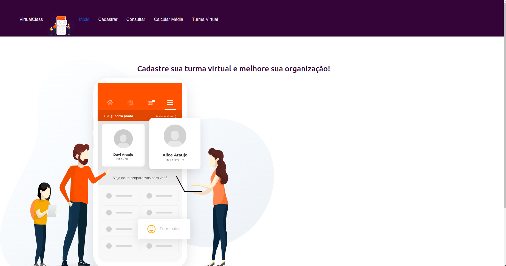

# VIRTUAL CLASS

Projeto criado para encerrar a disciplina Programação para Internet no curso técnico em informática do IFRN campus Parnamirim.

📎 [Acesse em](https://rmarques-s.github.io/Projeto-Angular---Virtual-Class/)

